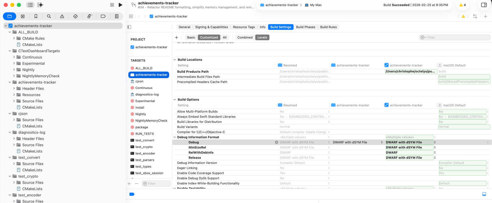
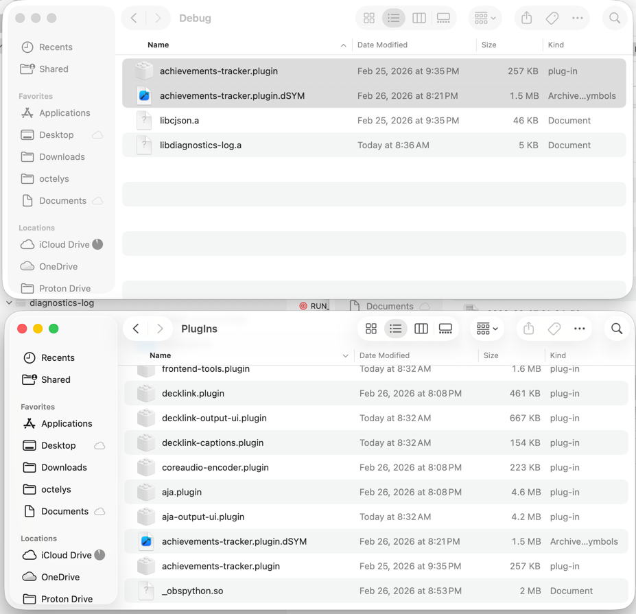
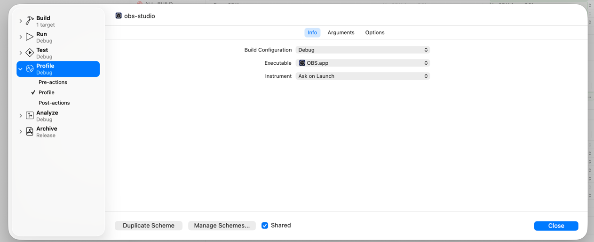

# OBS Achievements Tracker

A cross-platform OBS Studio plugin that displays Xbox Live profile data, current game information, and achievement progress for the signed-in Xbox user.

## Features

- **Xbox sign-in source** using Microsoft's device-code flow
- **Real-time game and achievement tracking** through Xbox Live RTA monitoring when available
- **Profile sources** for gamertag, gamerpic, and gamerscore
- **Achievement sources** for name, description, icon, and progress count
- **Customizable text sources** with persisted font and gradient color settings
- **Cross-platform builds** for Windows, macOS, and Linux

---

## User Guide

### Installation

Download the latest release from the [Releases page](https://github.com/Octelys/achievements-tracker-plugin/releases).

- **Windows x64 / ARM64**: installer (`.exe`) and portable archive (`.zip`)
- **macOS**: installer (`.pkg`) and manual archive (`.tar.xz`)
- **Linux x86_64**: portable archives (`.zip` / `.tar.xz`) and Debian package assets when produced by the release workflow

#### Windows

Preferred: run the `.exe` installer.

For manual installation from the `.zip`, extract the archive into:

- `%ALLUSERSPROFILE%\obs-studio\plugins\`

The archive is laid out so that files land under:

- `achievements-tracker\bin\64bit\`
- `achievements-tracker\data\`

#### macOS

Preferred: run the `.pkg` installer.

For manual installation from the `.tar.xz`, copy `achievements-tracker.plugin` to:

- `~/Library/Application Support/obs-studio/plugins/`

#### Linux

If a `.deb` asset is available for the release, that is the easiest installation path.

For manual installation from the `.zip` or `.tar.xz`, preserve the archive layout under your chosen prefix. The release archive contains a `lib/` tree for the plugin binary and a `share/` tree for plugin resources.

After installation, restart OBS Studio.

### Configuration

1. Open OBS Studio.
2. Add a new **Source** → **Xbox Account**.
3. In the source properties, click **Sign in with Xbox**.
4. A browser window opens for Microsoft account authentication.
5. Once authentication succeeds, add any of the Xbox display sources you want to use in your scene.

### Available OBS Sources

#### Account & profile

- **Xbox Account**: sign-in / sign-out source
- **Xbox Gamertag**: text source for the current gamertag
- **Xbox Gamerpic**: image source for the current gamerpic
- **Xbox Gamerscore**: text source for the current gamerscore

#### Game

- **Xbox Game Cover**: image source for the currently active game's cover art

#### Achievements

- **Xbox Achievement (Name)**: current achievement name, including gamerscore when available
- **Xbox Achievement (Description)**: current achievement description
- **Xbox Achievement (Icon)**: current achievement icon
- **Xbox Achievements Count**: unlocked / total achievements for the current game (for example `12 / 50`)

#### Real-time updates

When Xbox Live monitoring is available, the plugin subscribes to:

- current game / presence changes
- achievement progression updates

Profile-derived sources such as gamerscore, gamertag, and gamerpic refresh from the authenticated session data used by the plugin.

---

## Developer Documentation

### Repository Structure

```text
achievements-tracker-plugin/
├── src/
│   ├── main.c                      # OBS module entry point
│   ├── common/                     # Shared types and value objects
│   ├── crypto/                     # Proof-of-possession signing helpers
│   ├── diagnostics/                # Logging helpers
│   ├── drawing/                    # Color and image rendering helpers
│   ├── encoding/                   # Base64 helpers
│   ├── io/                         # Persistent state and cache helpers
│   ├── net/                        # Browser, HTTP, and JSON helpers
│   ├── oauth/                      # Xbox/Microsoft authentication flow
│   ├── sources/
│   │   ├── common/                 # Shared text/image source helpers
│   │   └── xbox/                   # OBS source implementations
│   ├── text/                       # Conversion and parsing helpers
│   ├── time/                       # Time parsing utilities
│   ├── util/                       # UUID and portability helpers
│   └── xbox/                       # Xbox client, monitor, and session logic
├── test/                           # Unity-based unit tests and stubs
├── data/                           # Locale files and effects/resources
├── external/cjson/                 # Vendored cJSON
├── cmake/                          # Platform-specific CMake helpers
├── .github/                        # CI workflows and composite actions
├── CMakeLists.txt
├── CMakePresets.json
└── buildspec.json
```

### Authentication Sequence

The plugin implements the Xbox Live authentication flow with proof-of-possession signing:

#### 1. Microsoft OAuth device-code flow

- Request `device_code` and `user_code` from `https://login.live.com/oauth20_connect.srf`
- Open the browser to `https://login.live.com/oauth20_remoteconnect.srf?otc=<user_code>`
- Poll `https://login.live.com/oauth20_token.srf` until authorization completes
- Store the returned Microsoft access token and refresh token

#### 2. Xbox device token

- Generate or reuse a persisted EC P-256 device keypair
- Authenticate against `https://device.auth.xboxlive.com/device/authenticate`
- Store the returned device token

#### 3. SISU authorization

- Call `https://sisu.xboxlive.com/authorize`
- Exchange the Microsoft token + device token for Xbox identity data
- Persist the resulting Xbox token and identity fields (`gtg`, `xid`, `uhs`)

#### 4. Token storage and refresh

- Persisted state is stored via `obs_module_config_path("")`
- The state file name is `achievements-tracker-state.json`
- On startup the plugin tries, in order:
  1. cached user token
  2. refresh-token exchange
  3. full device-code flow

#### 5. Authenticated API calls

Xbox REST requests use the header:

```text
Authorization: XBL3.0 x=<uhs>;<xsts_token>
```

Examples used by the plugin include profile, title art, presence, and achievement endpoints under `*.xboxlive.com`.

---

## Building from Source

### Prerequisites

- **CMake** 3.28+
- **OBS Studio** development headers and libraries compatible with the version pinned in `buildspec.json` (currently `31.1.1`)
- **OpenSSL** 3.x
- **libcurl**
- **FreeType** 2.x
- **zlib**
- **libuuid** on Linux/BSD
- A C11-capable compiler

`libwebsockets` is also needed for Xbox Live RTA monitoring. The exact strategy differs by platform.

### Dependency / linking notes

| Platform | Current approach |
| --- | --- |
| **Windows** | Uses static vcpkg packages such as `*-windows-static-md` for dependencies like OpenSSL and libwebsockets. |
| **macOS** | Uses Homebrew / obs-deps style libraries for local and CI builds; universal builds require universal-compatible dependencies. |
| **Linux** | CI/package builds deliberately prefer a PIC static `libwebsockets` build on Ubuntu so the plugin can link cleanly as an OBS-loaded shared object. |

### Platform-specific setup

#### macOS

1. Install local build dependencies:

```bash
brew install cmake openssl@3 curl freetype libwebsockets
```

2. Clone and configure the local development preset:

```bash
git clone https://github.com/Octelys/achievements-tracker-plugin.git
cd achievements-tracker-plugin
cmake --preset macos-dev
```

3. Build:

```bash
cmake --build build_macos_dev --config Debug
```

or 

```bash
xcodebuild -configuration Debug -scheme achievements-tracker -parallelizeTargets -destination "generic/platform=macOS,name=Any Mac"
```

4. The plugin bundle is produced at:

```text
build_macos_dev/Debug/achievements-tracker.plugin
```

5. Copy it into OBS's plugin folder:

```bash
cp -r build_macos_dev/Debug/achievements-tracker.plugin \
  ~/Library/Application\ Support/obs-studio/plugins/
```

##### Universal macOS build notes

The CI workflow uses the `macos-ci` preset and prepares universal dependencies before packaging. If you want to experiment locally with the CI-style build:

```bash
./scripts/build-universal-freetype.sh
cmake --preset macos-ci
cmake --build build_macos --config RelWithDebInfo
```

#### Windows

1. Install dependency packages with vcpkg:

```powershell
# x64
vcpkg install openssl:x64-windows-static-md libwebsockets:x64-windows-static-md

# ARM64
vcpkg install openssl:arm64-windows-static-md libwebsockets:arm64-windows-static-md
```

2. Point `CMAKE_PREFIX_PATH` at the corresponding vcpkg installation and configure:

```powershell
# x64
$env:CMAKE_PREFIX_PATH = "$env:VCPKG_INSTALLATION_ROOT\installed\x64-windows-static-md"
cmake --preset windows-x64

# ARM64
$env:CMAKE_PREFIX_PATH = "$env:VCPKG_INSTALLATION_ROOT\installed\arm64-windows-static-md"
cmake --preset windows-arm64
```

3. Build:

```powershell
cmake --build build_x64 --config RelWithDebInfo
# or
cmake --build build_arm64 --config RelWithDebInfo
```

##### Signing Windows binaries and installers

Windows builds can Authenticode-sign the plugin DLL during the normal build and the NSIS installer during `package-installer` packaging.

Set one of the following certificate inputs before configuring the Windows preset:

- `WINDOWS_SIGN_CERT_FILE` + optional `WINDOWS_SIGN_CERT_PASSWORD` for a `.pfx` / PKCS#12 certificate file
- `WINDOWS_SIGN_CERT_SHA1` for a certificate already imported into the local Windows certificate store

Optional environment variables:

- `WINDOWS_SIGN_TIMESTAMP_URL` (defaults to `http://timestamp.digicert.com`)
- `WINDOWS_SIGN_FILE_DIGEST` (defaults to `SHA256`)
- `WINDOWS_SIGN_TIMESTAMP_DIGEST` (defaults to `SHA256`)
- `WINDOWS_SIGN_DESCRIPTION`
- `WINDOWS_SIGN_DESCRIPTION_URL`
- `WINDOWS_SIGNTOOL_PATH` if `signtool.exe` is not discoverable from the installed Windows SDK

Example with a local `.pfx`:

```powershell
$env:WINDOWS_SIGN_CERT_FILE = 'C:\certs\achievements-tracker.pfx'
$env:WINDOWS_SIGN_CERT_PASSWORD = 'your-pfx-password'
$env:WINDOWS_SIGN_DESCRIPTION = 'Achievements Tracker'
$env:WINDOWS_SIGN_DESCRIPTION_URL = 'https://github.com/Octelys/achievements-tracker-plugin'

cmake --preset windows-x64 -DWINDOWS_CODESIGN=ON
cmake --build build_x64 --config Release
cmake --build build_x64 --target package-installer --config Release
```

When `WINDOWS_CODESIGN=ON`, the build fails if the certificate configuration is incomplete so unsigned release artifacts are not produced accidentally.

4. Install into OBS's default shared plugin location:

```powershell
cmake --install build_x64 --config RelWithDebInfo
```

By default, the Windows CMake setup installs into `%ALLUSERSPROFILE%\obs-studio\plugins\`.

##### GitHub Actions secrets for Windows signing

The Windows release jobs understand these repository secrets:

- `WINDOWS_SIGNING_CERT_BASE64` — base64-encoded `.pfx` / PKCS#12 certificate
- `WINDOWS_SIGNING_CERT_PASSWORD` — certificate password
- `WINDOWS_SIGNING_CERT_SHA1` — optional thumbprint-based alternative to the `.pfx` secret
- `WINDOWS_SIGNING_TIMESTAMP_URL` — optional RFC 3161 timestamp URL override

If none of those certificate secrets are present, the workflow automatically skips Windows signing while continuing to build unsigned artifacts.

#### Linux

For a simple local build on Ubuntu, install the common development packages:

```bash
sudo apt-get update
sudo apt-get install -y \
  cmake \
  libssl-dev \
  libcurl4-openssl-dev \
  uuid-dev \
  libfreetype6-dev \
  libwebsockets-dev \
  zlib1g-dev
```

Then configure and build:

```bash
cmake --preset ubuntu-x86_64
cmake --build build_x86_64 --config RelWithDebInfo
```

Install with:

```bash
cmake --install build_x86_64 --config RelWithDebInfo
```

For CI/release-style Ubuntu builds, see `.github/scripts/build-ubuntu` and `.github/scripts/utils.zsh/setup_ubuntu`, which additionally build a PIC static `libwebsockets` for packaging compatibility.

---

## Running Tests

The project uses [Unity](https://github.com/ThrowTheSwitch/Unity) for unit tests.

### macOS

Local development preset:

```bash
cmake --preset macos-dev -DBUILD_TESTING=ON
cmake --build build_macos_dev --config Debug
ctest --test-dir build_macos_dev -C Debug --output-on-failure
```

CI-style universal preset:

```bash
cmake --preset macos-ci -DBUILD_TESTING=ON
cmake --build build_macos --config RelWithDebInfo
ctest --test-dir build_macos -C RelWithDebInfo --output-on-failure
```

### Linux

```bash
cmake --preset ubuntu-x86_64 -DBUILD_TESTING=ON
cmake --build build_x86_64 --config RelWithDebInfo
ctest --test-dir build_x86_64 --output-on-failure
```

### Windows

```powershell
cmake --preset windows-x64 -DBUILD_TESTING=ON
cmake --build build_x64 --config RelWithDebInfo
ctest --test-dir build_x64 -C RelWithDebInfo --output-on-failure
```

### Running individual tests

Examples on macOS debug builds:

```bash
cmake --build build_macos_dev --target test_encoder --config Debug
./build_macos_dev/Debug/test_encoder

cmake --build build_macos_dev --target test_crypto --config Debug
./build_macos_dev/Debug/test_crypto

cmake --build build_macos_dev --target test_convert --config Debug
./build_macos_dev/Debug/test_convert

cmake --build build_macos_dev --target test_parsers --config Debug
./build_macos_dev/Debug/test_parsers
```

---

## Profiling

### macOS

Ensure the plugin is built in `Debug`:

```bash
xcodebuild -configuration Debug -scheme achievements-tracker -parallelizeTargets -destination "generic/platform=macOS,name=Any Mac"
```

Ensure the plugin Xcode project is configured to generate `dSYM` files:



Copy both the plugin bundle and its `dSYM` into the debug OBS plugin location:



Then open `obs-studio` in Xcode and make sure the `Debug` configuration is selected for profiling:



---

## References

- https://learn.microsoft.com/en-us/gaming/gdk/docs/reference/live/rest/uri/gamerpic/atoc-reference-gamerpic
- https://deepwiki.com/microsoft/xbox-live-api/5-real-time-activity-system#resource-uri-format

## Contributing

Contributions are welcome. Please open an issue or submit a pull request.

## Support

For issues, questions, or feature requests, visit [GitHub Issues](https://github.com/Octelys/achievements-tracker-plugin/issues).
