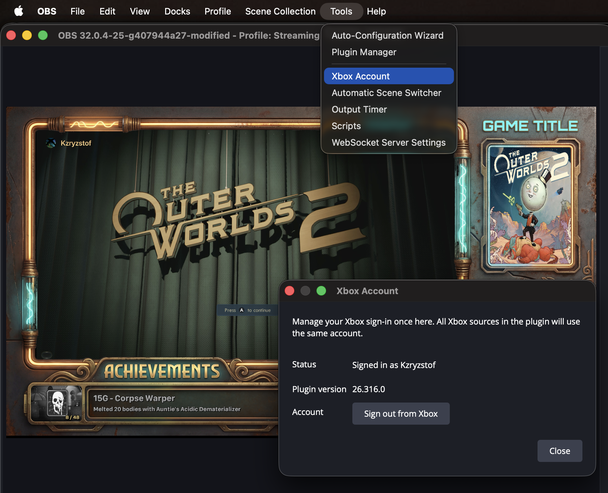
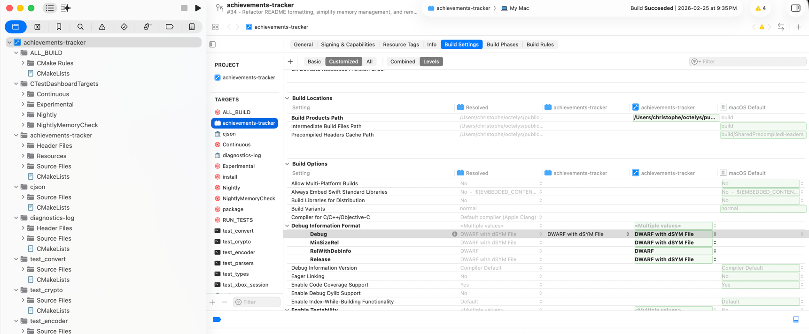
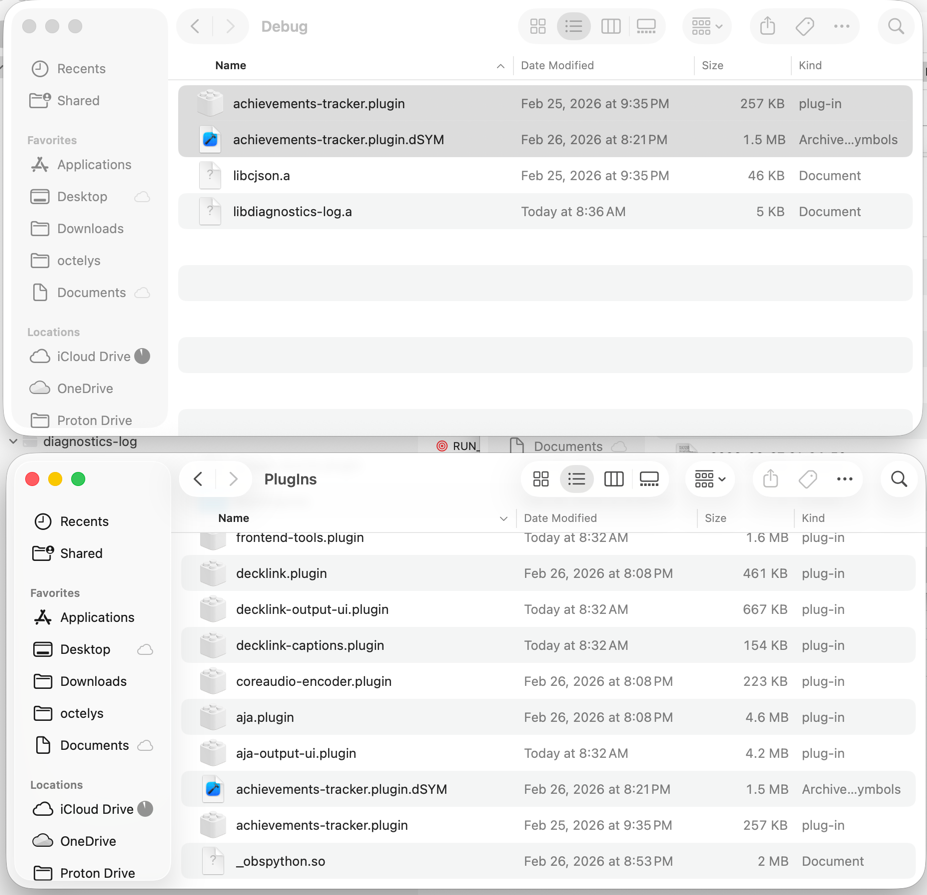
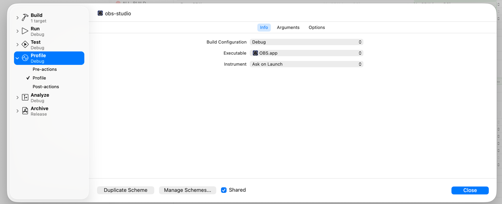

# OBS Achievements Tracker

A cross-platform OBS Studio plugin that displays Xbox Live and RetroAchievements profile data, current game information, and achievement progress for the signed-in user.

## Table of Contents

- [Features](#features)
- [User Guide](#user-guide)
  - [Installation](#installation)
  - [Configuration](#configuration)
  - [Available OBS Sources](#available-obs-sources)
- [Developer Documentation](#developer-documentation)
  - [Repository Structure](#repository-structure)
  - [Authentication Sequence](#authentication-sequence)
- [Building from Source](#building-from-source)
  - [Prerequisites](#prerequisites)
  - [Dependency / linking notes](#dependency--linking-notes)
  - [Platform-specific setup](#platform-specific-setup)
- [Running Tests](#running-tests)
  - [macOS](#macos-2)
  - [Linux](#linux-2)
  - [Windows](#windows-2)
  - [Running individual tests](#running-individual-tests)
- [Profiling](#profiling)
- [References](#references)
- [Contributing](#contributing)
- [Support](#support)

## Features

- **Global Xbox account configuration dialog** using Microsoft's device-code flow
- **Real-time game and achievement tracking** through Xbox Live RTA monitoring when available
- **RetroAchievements integration** via a local RetroArch WebSocket server for retro game tracking — requires the [Octelys custom build of RetroArch](https://github.com/Octelys/retro-arch/releases/latest)
- **Unified monitoring service** that handles both Xbox and RetroAchievements sessions with last-game-received priority
- **Profile sources** for gamertag, gamerpic, and gamerscore
- **Achievement sources** for name, description, icon, and progress count
- **Game cover art** drawn at its true aspect ratio with optional per-orientation (Square / Portrait / Landscape) decorative borders
- **Automatic achievement cycle** that rotates through the last unlocked achievement and random locked achievements on a configurable timer
- **Manual navigation hotkeys** (default: Shift+← / Shift+→) to step through achievements on demand
- **Auto show/hide** per-source toggle with globally shared visible / hidden / fade durations configurable from one place
- **Customizable text sources** with persisted font and gradient color settings
- **Cross-platform builds** for Windows, macOS, and Linux

---

## User Guide

### Installation

Download the latest release from the [Releases page](https://github.com/Octelys/achievements-tracker-plugin/releases).

- **Windows x64 / ARM64**: installer (`.exe`) and portable archive (`.zip`)
- **macOS**: installer (`.pkg`) and manual archive (`.tar.xz`)
- **Linux x86_64**: portable archives (`.zip` / `.tar.xz`) and Debian package assets when produced by the release workflow

#### Windows

Preferred: run the `.exe` installer.

For manual installation from the `.zip`, extract the archive into:

- `%ALLUSERSPROFILE%\obs-studio\plugins\`

The archive is laid out so that files land under:

- `achievements-tracker\bin\64bit\`
- `achievements-tracker\data\`

#### macOS

Preferred: run the `.pkg` installer.

For manual installation from the `.tar.xz`, copy `achievements-tracker.plugin` to:

- `~/Library/Application Support/obs-studio/plugins/`

#### Linux

If a `.deb` asset is available for the release, that is the easiest installation path.

For manual installation from the `.zip` or `.tar.xz`, preserve the archive layout under your chosen prefix. The release archive contains a `lib/` tree for the plugin binary and a `share/` tree for plugin resources.

After installation, restart OBS Studio.

### Configuration

#### Xbox account sign-in

1. Open OBS Studio.
2. Open **Tools** → **Xbox Account**.
3. Use the global Xbox Account dialog to review the current status and click **Sign in with Xbox**.
4. A browser window opens for Microsoft account authentication.
5. Once authentication succeeds, return to OBS. The dialog will update to show the connected account.
6. Add any of the display sources you want to use in your scene.

All Xbox sources in the plugin share the same authenticated account. RetroAchievements sources connect automatically when a RetroArch WebSocket server is detected on the local machine.

> **⚠️ RetroAchievements requires a custom build of RetroArch**
>
> The standard RetroArch release does not include the WebSocket game-state server used by this plugin. You must install the **Octelys custom build of RetroArch**, which adds that server.
>
> Download the latest release: [github.com/Octelys/retro-arch/releases/latest](https://github.com/Octelys/retro-arch/releases/latest) (currently **RetroArch 1.22.2.37**)
>
> Available for **Windows (x64)**, **macOS**, and **Linux (x86_64)**.



#### Achievement Tracker dialog

Open **Tools** → **Achievement Tracker** to access navigation hotkeys, display timing, and auto show/hide settings.

##### Navigation hotkeys

| Action | Default shortcut |
| --- | --- |
| Previous Achievement | Shift + ← |
| Next Achievement | Shift + → |
| First Unlocked Achievement | Shift + ↑ |
| First Locked Achievement | Shift + ↓ |
| Toggle Auto Cycle | Shift + Space |

To change these shortcuts, open **OBS Settings** → **Hotkeys** and search for _Achievement Tracker_. The defaults are applied automatically the first time the plugin loads; after that OBS persists any changes you make.

The dialog also provides **← Previous**, **Next →**, **⊤ First Unlocked**, **⊥ First Locked**, and **Toggle Cycle** buttons as a fallback when global hotkeys are unavailable (for example on macOS without Input Monitoring permission).

##### Display Timing

Controls how long each phase of the automatic achievement cycle is displayed.

| Setting | Default | Description |
| --- | --- | --- |
| Last unlocked | 45 s | Seconds to show the most recently unlocked achievement. |
| Each locked | 30 s | Seconds to show each random locked achievement during the rotation. |
| Locked rotation total | 120 s | Total seconds to spend in the locked-rotation phase. |

Constraints enforced by the UI and the cycle engine:
- Minimum value for any duration: **5 seconds**.
- **Locked rotation total** must be ≥ **Each locked** — guaranteeing at least one locked achievement is shown per rotation pass.

##### Auto Show/Hide Durations

Controls the shared timing used by all sources whose per-source **Auto show/hide** toggle is enabled.

| Setting | Default | Description |
| --- | --- | --- |
| Visible for | 10 s | Seconds to keep the source fully visible. |
| Hidden for | 10 s | Seconds to keep the source fully hidden. |
| Fade duration | 0.35 s | Duration of each fade-in / fade-out transition. |

These durations are **global** — they apply to every source that has its toggle enabled. Changing them here and clicking **Save** takes effect immediately across all active sources.

The toggle itself is configured **per source**: open the source's properties panel in OBS and check or uncheck **Auto show/hide** to enable or disable the cycle for that individual source independently.

### Available OBS Sources

#### Account & profile

- **Gamertag**: text source for the current gamertag or RetroAchievements display name
- **Gamerpic**: image source for the current gamerpic or RetroAchievements avatar
- **Gamerscore**: text source for the current gamerscore or RetroAchievements score

Account sign-in and sign-out are managed globally from **Tools** → **Xbox Account**.

Each text and image source exposes an **Auto show/hide** toggle in its properties panel. When enabled, the source fades in and out on the shared schedule configured in **Tools** → **Achievement Tracker** → **Auto Show/Hide Durations**.

#### Game

- **Game Cover**: image source for the currently active game's cover art
- **Game Name**: text source for the currently active game's title

##### Game Cover borders

The **Game Cover** source draws the downloaded cover art at its **true aspect ratio**
(fitted and centred, never stretched) and can frame it with an optional decorative
border. Because covers come in different shapes, the source properties expose three
independent border image pickers:

| Property | Applied to covers whose aspect ratio is… |
| --- | --- |
| **Square border** | roughly square (between ~0.87 and ~1.15) |
| **Portrait border** | taller than wide (< ~0.87) |
| **Landscape border** | wider than tall (> ~1.15) |

Each border is a local image file — typically a frame with a transparent centre. At
render time the plugin measures the loaded cover, classifies it into one of the three
buckets, draws the cover inset by the configured **Border width**, and overlays the
matching border on top. Borders are **opt-in**: an unset picker renders the fitted
cover with no frame.

A **Border width (px)** slider (default 15 px, range 0–200) controls the padding left
between the cover art and the frame on every side, applied uniformly across all three
orientations. It only affects the artwork's inset — the frame image itself is drawn at
its own dimensions.

To keep the scene item from jumping in size as games come and go, the source reports a
**fixed footprint** equal to the **Square border** image's dimensions and composites
every orientation inside it — the square border fills the box exactly, while portrait
and landscape borders sit centred with transparent padding on the short axis. Until a
Square border is configured, the footprint falls back to the selected border (or the
bare cover).

Because the footprint is pinned to the square border, each orientation also has its own
**frame margin** slider — **Square / Portrait / Landscape frame margin (px)** (default
0, range 0–1000). The margin shrinks the box that the frame is fitted into on every
side, so a frame (the space-filling square one in particular) can be made to occupy
less than the full footprint while the source's reported size stays put. A margin of 0
fills the box as before.

Border image paths persist across OBS restarts via the source's settings, and the
border honours the source's **Auto show/hide** toggle, fading in and out together with
the cover.

#### Achievements

- **Achievement (Name)**: current achievement name, including gamerscore when available
- **Achievement (Description)**: current achievement description
- **Achievement (Icon)**: current achievement icon
- **Achievements' Count**: unlocked / total achievements for the current game (for example `12 / 50`)

Each achievement source also exposes an **Auto show/hide** toggle in its properties panel (see [Auto Show/Hide Durations](#auto-showhide-durations) above).

#### Text alignment

Every text source exposes a **Text alignment** property (Left / Center / Right). Because
each title can differ in length, the source keeps an auto-sized box as wide as the widest
text it has seen (persisted across restarts so it does not collapse before the first title
appears) and positions shorter text within that box according to this setting. Left
reproduces the historical behaviour (text anchored to the source's left edge).

> **Important:** this in-source alignment only works when the scene item is drawn at its
> native size. Set the item's **Edit Transform → Bounding Box Type** to **No bounds**. With
> any bounding box, OBS scales the source's reported width into that box and stretches the
> text — use OBS's own **Positional Alignment** instead if you rely on a bounding box.

#### Achievement display cycle

The four achievement sources above all stay in sync via a shared display cycle. Once the game session is fully ready (all achievement icons cached locally), the cycle runs automatically:

| Phase | Default duration | What is shown |
| --- | --- | --- |
| Last unlocked | 45 s | The most recently unlocked achievement. If no achievement has been unlocked yet, a random locked achievement is shown instead. |
| Locked rotation | 120 s total (30 s each) | Random locked achievements, cycling every 30 seconds. |

After the locked rotation phase ends the cycle returns to the last-unlocked phase and repeats.

All three durations are configurable from **Tools** → **Achievement Tracker** → **Display Timing**. Changes take effect immediately and are persisted across OBS restarts.

**Manual navigation** lets you step through the full achievement list at any time without waiting for the timer:

- **Shift + ←** — previous achievement
- **Shift + →** — next achievement
- **Shift + ↑** — jump to the first (most recently) unlocked achievement
- **Shift + ↓** — jump to the first locked achievement
- **Shift + Space** — toggle the automatic cycle on/off

Pressing ← / → immediately displays the adjacent achievement in the sorted list (unlocked achievements first, ordered by unlock time; locked achievements follow) and resets the phase timer so the selected achievement stays visible for the full interval before the automatic cycle resumes.

#### Real-time updates

When Xbox Live monitoring is available, the plugin subscribes to:

- current game / presence changes
- achievement progression updates

When a local RetroArch WebSocket server is detected, the plugin additionally tracks:

- current retro game changes
- achievement list and unlock updates
- user identity (display name, score, avatar)

> This requires the [Octelys custom build of RetroArch](https://github.com/Octelys/retro-arch/releases/latest), which includes the WebSocket game-state server not present in the standard RetroArch release.

The active identity shown in profile sources is determined by whichever integration last reported a game change. If only one integration has an active game, that integration's identity is used.

Profile-derived sources such as gamerscore, gamertag, and gamerpic refresh from the authenticated session data used by the plugin.

---

## Developer Documentation

### Repository Structure

```text
achievements-tracker-plugin/
├── src/
│   ├── main.c                          # OBS module entry point
│   ├── common/                         # Shared platform-agnostic types and value objects
│   │   ├── achievement.{c,h}           # Generic achievement abstraction
│   │   ├── game.{c,h}                  # Generic game abstraction
│   │   ├── gamerscore.{c,h}            # Gamerscore value object
│   │   ├── identity.{c,h}              # Unified user identity (Xbox + RetroAchievements)
│   │   └── token.{c,h}                 # Auth token value object
│   ├── crypto/                         # Proof-of-possession signing helpers
│   ├── diagnostics/                    # Logging helpers
│   ├── drawing/                        # Color and image rendering helpers
│   ├── encoding/                       # Base64 helpers
│   ├── integrations/
│   │   ├── monitoring_service.{c,h}    # Unified event fan-out for all integrations
│   │   ├── retro-achievements/         # RetroAchievements WebSocket monitor
│   │   └── xbox/
│   │       ├── account_manager.{c,h}   # Xbox account lifecycle
│   │       ├── contracts/              # Xbox-specific wire types (achievements, progress)
│   │       ├── entities/               # Xbox identity and session value objects
│   │       ├── oauth/                  # Xbox/Microsoft authentication flow
│   │       ├── xbox_client.{c,h}       # Xbox REST API client
│   │       ├── xbox_monitor.{c,h}      # Xbox Live RTA WebSocket monitor
│   │       └── xbox_session.{c,h}      # Xbox session state
│   ├── io/                             # Persistent state and cache helpers
│   ├── net/
│   │   ├── browser/                    # System browser launcher
│   │   ├── http/                       # HTTP client helpers
│   │   └── json/                       # JSON helpers
│   ├── sources/
│   │   ├── common/                     # Shared text/image source helpers and achievement cycle
│   │   ├── achievement_description.{c,h}
│   │   ├── achievement_icon.{c,h}
│   │   ├── achievement_name.{c,h}
│   │   ├── achievements_count.{c,h}
│   │   ├── game_cover.{c,h}
│   │   ├── gamerpic.{c,h}
│   │   ├── gamerscore.{c,h}
│   │   └── gamertag.{c,h}
│   ├── text/                           # Conversion and parsing helpers
│   ├── time/                           # Time parsing utilities
│   └── util/                           # UUID and portability helpers
├── test/                               # Unity-based unit tests and stubs
│   ├── stubs/
│   │   ├── integrations/               # Stubs for xbox_monitor and retro_achievements_monitor
│   │   ├── io/                         # Stub for cache
│   │   ├── xbox/                       # Stub for xbox_client
│   │   └── ...
│   ├── test_convert.c
│   ├── test_crypto.c
│   ├── test_encoder.c
│   ├── test_monitoring_service.c       # Tests for the unified monitoring service
│   ├── test_parsers.c
│   ├── test_types.c
│   └── test_xbox_session.c
├── data/                               # Locale files and effects/resources
├── external/cjson/                     # Vendored cJSON
├── cmake/                              # Platform-specific CMake helpers
├── .github/                            # CI workflows and composite actions
├── CMakeLists.txt
├── CMakePresets.json
└── buildspec.json
```

### Authentication Sequence

The plugin implements the Xbox Live authentication flow with proof-of-possession signing:

#### 1. Microsoft OAuth device-code flow

- Request `device_code` and `user_code` from `https://login.live.com/oauth20_connect.srf`
- Open the browser to `https://login.live.com/oauth20_remoteconnect.srf?otc=<user_code>`
- Poll `https://login.live.com/oauth20_token.srf` until authorization completes
- Store the returned Microsoft access token and refresh token

#### 2. Xbox device token

- Generate or reuse a persisted EC P-256 device keypair
- Authenticate against `https://device.auth.xboxlive.com/device/authenticate`
- Store the returned device token

#### 3. SISU authorization

- Call `https://sisu.xboxlive.com/authorize`
- Exchange the Microsoft token + device token for Xbox identity data
- Persist the resulting Xbox token and identity fields (`gtg`, `xid`, `uhs`)

#### 4. Token storage and refresh

- Persisted state is stored via `obs_module_config_path("")`
- The state file name is `achievements-tracker-state.json`
- On startup the plugin tries, in order:
  1. cached user token
  2. refresh-token exchange
  3. full device-code flow

#### 5. Authenticated API calls

Xbox REST requests use the header:

```text
Authorization: XBL3.0 x=<uhs>;<xsts_token>
```

Examples used by the plugin include profile, title art, presence, and achievement endpoints under `*.xboxlive.com`.

---

## Building from Source

### Prerequisites

- **CMake** 3.28+
- **OBS Studio** development headers and libraries compatible with the version pinned in `buildspec.json` (currently `31.1.1`)
- **OpenSSL** 3.x
- **libcurl**
- **FreeType** 2.x
- **zlib**
- **libuuid** on Linux/BSD
- A C11-capable compiler

`libwebsockets` is also needed for Xbox Live RTA monitoring. The exact strategy differs by platform.

### Dependency / linking notes

| Platform | Current approach |
| --- | --- |
| **Windows** | Uses static vcpkg packages such as `*-windows-static-md` for dependencies like OpenSSL and libwebsockets. |
| **macOS** | Uses Homebrew / obs-deps style libraries for local and CI builds; universal builds require universal-compatible dependencies. |
| **Linux** | CI/package builds deliberately prefer a PIC static `libwebsockets` build on Ubuntu so the plugin can link cleanly as an OBS-loaded shared object. |

### Platform-specific setup

#### macOS

1. Install local build dependencies:

```bash
brew install cmake openssl@3 curl freetype libwebsockets
```

2. Clone and configure the local development preset:

```bash
git clone https://github.com/Octelys/achievements-tracker-plugin.git
cd achievements-tracker-plugin
cmake --preset macos-dev
```

3. Build:

```bash
cmake --build build_macos_dev --config Debug
```

or 

```bash
xcodebuild -configuration Debug -scheme achievements-tracker -parallelizeTargets -destination "generic/platform=macOS,name=Any Mac"
```

4. The plugin bundle is produced at:

```text
build_macos_dev/Debug/achievements-tracker.plugin
```

5. Install it. The easiest way is the helper script, which rebuilds and copies the
   bundle into the install location in one step (removing any stale copy first):

```bash
./install.sh
```

   `install.sh` installs into a **single** location:

   - `~/Library/Application Support/obs-studio/plugins/` — scanned by every OBS on
     the machine, whether Homebrew / App Store **or** a source-built `OBS.app`.

   > **Do not** also copy the plugin into a source-built `OBS.app`'s
   > `Contents/PlugIns`. That OBS already scans `~/Library/.../plugins`, so a bundle
   > copy would be loaded a **second time** by the same process
   > (`obs_register_source: Source '...' already exists! Duplicate library?`). The two
   > instances each start their own monitor thread and fight over the connection,
   > which churns connected↔disconnected and blanks out every text source. To clean up
   > a duplicate left by an older `install.sh`, run it again — it now removes the stale
   > bundle copy at `OBS_APP_PLUGIN_DIR` (override that path if your `OBS.app` lives
   > elsewhere).

   To install manually instead:

```bash
cp -r build_macos_dev/Debug/achievements-tracker.plugin \
  ~/Library/Application\ Support/obs-studio/plugins/
```

##### Troubleshooting: stale SDK path after an Xcode update

After updating Xcode or the macOS SDK, `cmake --preset macos-dev` may fail with errors like:

```text
Imported target "ZLIB::ZLIB" includes non-existent path
  ".../SDKs/MacOSX26.2.sdk/usr/include"
Imported target "OpenGL::GL" includes non-existent path
  ".../SDKs/MacOSX26.2.sdk/System/Library/Frameworks/OpenGL.framework"
```

This happens because the cached OBS-studio build directory was configured against the previous SDK version, which no longer exists on disk. Clear the stale caches and reconfigure:

```bash
rm -rf .deps/obs-studio-31.1.1/build_universal build_macos_dev
cmake --preset macos-dev
```

(Adjust the OBS version in the path if `.deps/obs-studio-*` differs.) The reinstalled Homebrew packages are unrelated to this failure.

##### Troubleshooting: plugin fails to load after a Homebrew upgrade

OBS may refuse to load the plugin with an error like:

```text
Library not loaded: /opt/homebrew/opt/libwebsockets/lib/libwebsockets.21.dylib
  Reason: tried: '.../libwebsockets.21.dylib' (no such file), ...
```

This happens when `brew upgrade` bumps a dependency to a new major version with a
different dylib soname (e.g. `libwebsockets` 4.x → 5.0.0 replaces
`libwebsockets.21.dylib` with `libwebsockets.22.dylib`). The **already-installed**
plugin binary still has the old version baked into its load commands, so `dlopen`
fails and the entire plugin is skipped.

The fix is to rebuild against the new library and reinstall:

```bash
cmake --build build_macos_dev --config Debug
./install.sh
```

You can confirm which version a binary references with:

```bash
otool -L build_macos_dev/Debug/achievements-tracker.plugin/Contents/MacOS/achievements-tracker | grep websockets
```

##### Universal macOS build notes

The CI workflow uses the `macos-ci` preset and prepares universal dependencies before packaging. If you want to experiment locally with the CI-style build:

```bash
./scripts/build-universal-freetype.sh
cmake --preset macos-ci
cmake --build build_macos --config RelWithDebInfo
```

#### Windows

1. Install dependency packages with vcpkg:

```powershell
# x64
vcpkg install openssl:x64-windows-static-md libwebsockets:x64-windows-static-md

# ARM64
vcpkg install openssl:arm64-windows-static-md libwebsockets:arm64-windows-static-md
```

2. Point `CMAKE_PREFIX_PATH` at the corresponding vcpkg installation and configure:

```powershell
# x64
$env:CMAKE_PREFIX_PATH = "$env:VCPKG_INSTALLATION_ROOT\installed\x64-windows-static-md"
cmake --preset windows-x64

# ARM64
$env:CMAKE_PREFIX_PATH = "$env:VCPKG_INSTALLATION_ROOT\installed\arm64-windows-static-md"
cmake --preset windows-arm64
```

3. Build:

```powershell
cmake --build build_x64 --config RelWithDebInfo
# or
cmake --build build_arm64 --config RelWithDebInfo
```

##### Signing Windows binaries and installers

Windows builds can Authenticode-sign the plugin DLL during the normal build and the NSIS installer during `package-installer` packaging.

Set one of the following certificate inputs before configuring the Windows preset:

- `WINDOWS_SIGN_CERT_FILE` + optional `WINDOWS_SIGN_CERT_PASSWORD` for a `.pfx` / PKCS#12 certificate file
- `WINDOWS_SIGN_CERT_SHA1` for a certificate already imported into the local Windows certificate store

Optional environment variables:

- `WINDOWS_SIGN_TIMESTAMP_URL` (defaults to `http://timestamp.digicert.com`)
- `WINDOWS_SIGN_FILE_DIGEST` (defaults to `SHA256`)
- `WINDOWS_SIGN_TIMESTAMP_DIGEST` (defaults to `SHA256`)
- `WINDOWS_SIGN_DESCRIPTION`
- `WINDOWS_SIGN_DESCRIPTION_URL`
- `WINDOWS_SIGNTOOL_PATH` if `signtool.exe` is not discoverable from the installed Windows SDK

Example with a local `.pfx`:

```powershell
$env:WINDOWS_SIGN_CERT_FILE = 'C:\certs\achievements-tracker.pfx'
$env:WINDOWS_SIGN_CERT_PASSWORD = 'your-pfx-password'
$env:WINDOWS_SIGN_DESCRIPTION = 'Achievements Tracker'
$env:WINDOWS_SIGN_DESCRIPTION_URL = 'https://github.com/Octelys/achievements-tracker-plugin'

cmake --preset windows-x64 -DWINDOWS_CODESIGN=ON
cmake --build build_x64 --config Release
cmake --build build_x64 --target package-installer --config Release
```

When `WINDOWS_CODESIGN=ON`, the build fails if the certificate configuration is incomplete so unsigned release artifacts are not produced accidentally.

4. Install into OBS's default shared plugin location:

```powershell
cmake --install build_x64 --config RelWithDebInfo
```

By default, the Windows CMake setup installs into `%ALLUSERSPROFILE%\obs-studio\plugins\`.

##### GitHub Actions secrets for Windows signing

The Windows release jobs understand these repository secrets:

- `WINDOWS_SIGNING_CERT_BASE64` — base64-encoded `.pfx` / PKCS#12 certificate
- `WINDOWS_SIGNING_CERT_PASSWORD` — certificate password
- `WINDOWS_SIGNING_CERT_SHA1` — optional thumbprint-based alternative to the `.pfx` secret
- `WINDOWS_SIGNING_TIMESTAMP_URL` — optional RFC 3161 timestamp URL override

If none of those certificate secrets are present, the workflow automatically skips Windows signing while continuing to build unsigned artifacts.

#### Linux

For a simple local build on Ubuntu, install the common development packages:

```bash
sudo apt-get update
sudo apt-get install -y \
  cmake \
  libssl-dev \
  libcurl4-openssl-dev \
  uuid-dev \
  libfreetype6-dev \
  libwebsockets-dev \
  zlib1g-dev
```

Then configure and build:

```bash
cmake --preset ubuntu-x86_64
cmake --build build_x86_64 --config RelWithDebInfo
```

Install with:

```bash
cmake --install build_x86_64 --config RelWithDebInfo
```

For CI/release-style Ubuntu builds, see `.github/scripts/build-ubuntu` and `.github/scripts/utils.zsh/setup_ubuntu`, which additionally build a PIC static `libwebsockets` for packaging compatibility.

---

## Running Tests

The project uses [Unity](https://github.com/ThrowTheSwitch/Unity) for unit tests.

### macOS

Local development preset:

```bash
cmake --preset macos-dev -DBUILD_TESTING=ON
cmake --build build_macos_dev --config Debug
ctest --test-dir build_macos_dev -C Debug --output-on-failure
```

CI-style universal preset:

```bash
cmake --preset macos-ci -DBUILD_TESTING=ON
cmake --build build_macos --config RelWithDebInfo
ctest --test-dir build_macos -C RelWithDebInfo --output-on-failure
```

### Linux

```bash
cmake --preset ubuntu-x86_64 -DBUILD_TESTING=ON
cmake --build build_x86_64 --config RelWithDebInfo
ctest --test-dir build_x86_64 --output-on-failure
```

### Windows

```powershell
cmake --preset windows-x64 -DBUILD_TESTING=ON
cmake --build build_x64 --config RelWithDebInfo
ctest --test-dir build_x64 -C RelWithDebInfo --output-on-failure
```

### Running individual tests

Examples on macOS debug builds:

```bash
cmake --build build_macos_dev --target test_encoder --config Debug
./build_macos_dev/Debug/test_encoder

cmake --build build_macos_dev --target test_crypto --config Debug
./build_macos_dev/Debug/test_crypto

cmake --build build_macos_dev --target test_convert --config Debug
./build_macos_dev/Debug/test_convert

cmake --build build_macos_dev --target test_parsers --config Debug
./build_macos_dev/Debug/test_parsers

cmake --build build_macos_dev --target test_monitoring_service --config Debug
./build_macos_dev/Debug/test_monitoring_service
```

---

## Profiling

### macOS

Ensure the plugin is built in `Debug`:

```bash
xcodebuild -configuration Debug -scheme achievements-tracker -parallelizeTargets -destination "generic/platform=macOS,name=Any Mac"
```

Ensure the plugin Xcode project is configured to generate `dSYM` files:



Copy both the plugin bundle and its `dSYM` into the debug OBS plugin location:



Then open `obs-studio` in Xcode and make sure the `Debug` configuration is selected for profiling:



---

## References

- https://learn.microsoft.com/en-us/gaming/gdk/docs/reference/live/rest/uri/gamerpic/atoc-reference-gamerpic
- https://deepwiki.com/microsoft/xbox-live-api/5-real-time-activity-system#resource-uri-format

## Contributing

Contributions are welcome. Please open an issue or submit a pull request.

## Support

For issues, questions, or feature requests, visit [GitHub Issues](https://github.com/Octelys/achievements-tracker-plugin/issues).
